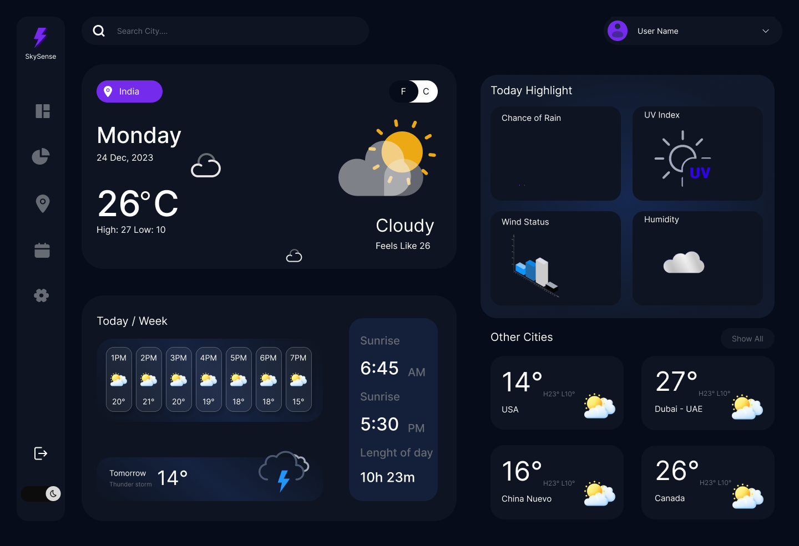

# ⚡ Lumina Weather AI

> A professional-grade, full-stack AI weather dashboard with real-time meteorological data, AI insights, and an interactive world map.



---

## 📁 Project Structure

```
Lumina-Weather-AI/
│
├── backend/                    # Python / Flask server
│   ├── app.py                  # Main Flask application & API routes
│   ├── debug_weather.py        # Debug & test utility script
│   ├── requirements.txt        # Python dependencies
│   ├── Procfile                # Gunicorn config (for deployment)
│   ├── .env                    # API keys (not committed to git)
│   └── README.md               # Backend-specific docs
│
├── frontend/                   # HTML, CSS & JavaScript UI
│   ├── templates/
│   │   └── index.html          # Jinja2 template (rendered by Flask)
│   ├── static/
│   │   ├── style.css           # Core design system & layout
│   │   ├── theme.css           # Dark / light theme variables
│   │   ├── map.css             # Leaflet map modal styles
│   │   ├── app.js              # Dashboard logic & interactions
│   │   ├── app_extra.js        # Additional UI helpers
│   │   ├── map.js              # Interactive map (Leaflet.js)
│   │   ├── location.js         # Browser geolocation support
│   │   ├── favicon.jpg         # App favicon
│   │   └── cover.png           # Project cover image
│   └── README.md               # Frontend-specific docs
│
├── .gitignore
└── README.md                   ← You are here
```

---

## 🚀 Features

- 🌍 **Real-Time Weather** — Live data for any city via OpenWeatherMap API
- 🤖 **AI Smart Insights** — Outfit recommendations & activity tips via Groq (LLaMA 3.3 70B)
- 🗺️ **Interactive World Map** — Click anywhere on the map to get local weather (Leaflet.js)
- 📊 **5-Day Forecast** — Daily and hourly breakdown
- 🌬️ **AQI & Pollen** — Air quality index and pollen count via Open-Meteo
- ☀️ **UV Index** — Real-time UV tracking
- 🌙 **Dark / Light Mode** — Persistent theme toggling (localStorage)
- 🌡️ **Unit Toggle** — Instant °C ↔ °F switching
- ❤️ **Favorites Manager** — Pin cities for quick access
- 📍 **Geolocation** — One-click "Use My Location" support

---

## ⚙️ Setup & Installation

### Prerequisites
- Python 3.9+
- A free [OpenWeatherMap API key](https://openweathermap.org/api)
- A free [Groq API key](https://console.groq.com) (for AI insights)

### 1. Clone the Repository
```bash
git clone https://github.com/KadariUday/Lumina-Weather-AI.git
cd Lumina-Weather-AI
```

### 2. Set Up the Backend
```bash
cd backend
python -m venv venv
venv\Scripts\activate        # Windows
# source venv/bin/activate   # macOS/Linux
pip install -r requirements.txt
```

### 3. Configure Environment Variables
Create a `.env` file inside the `backend/` folder:
```env
OPENWEATHER_API_KEY=your_openweather_key_here
GROQ_API_KEY=your_groq_key_here
```

### 4. Run the Application
```bash
# From the backend/ directory:
python app.py
```
Then open **http://localhost:5000** in your browser.

---

## 🌐 Deployment (Heroku / Render)

The `Procfile` in `backend/` is pre-configured for Gunicorn:
```
web: gunicorn app:app
```
Set `OPENWEATHER_API_KEY` and `GROQ_API_KEY` as environment variables in your hosting dashboard.

---

## 🛠️ Tech Stack

| Layer     | Technology                        |
|-----------|-----------------------------------|
| Backend   | Python, Flask, Gunicorn           |
| AI        | Groq API (LLaMA 3.3 70B)          |
| Weather   | OpenWeatherMap API, Open-Meteo    |
| Frontend  | HTML5, CSS3, Vanilla JavaScript   |
| Map       | Leaflet.js                        |
| Icons     | Font Awesome 6                    |
| Fonts     | Google Fonts (Outfit)             |

---

## 👨‍💻 Author

**Kadari Uday**
[](https://www.linkedin.com/in/kadariuday)
